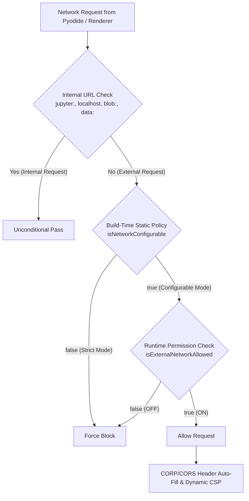

[English](security-network-policy.en.md) | [日本語](security-network-policy.md)

---
type: Architecture Specification
title: Security & Network Policy Specification
description: Technical architecture for external network control, defense-in-depth, and build-time security policies.
tags:
  - security
  - network
  - policy
  - electron
  - pyodide
status: stable
generated:
  by: agent:antigravity
  at: '2026-09-02T00:00:00Z'
---

# Security & Network Policy Specification

Specification for network request filtering, multi-tier defense mechanisms, and build-time security policies in `electron-jupyter-sandbox`.

---

## 🛡️ Core Principles & Multi-Tier Defense Architecture

This application delivers a secure Jupyter execution environment optimized for complete air-gapped isolation in local environments.
To satisfy air-gap security requirements in corporate environments while retaining flexibility for general development, it employs a multi-tiered defense architecture combining **Build-Time Policies**, **Runtime Configuration**, and **Browser Security Headers (CSP/COEP)**.



---

## 🔒 Two Security Modes

### 1. Strict Mode (Default / Air-Gapped)
* **Target Audience**: Enterprise, confidential data processing, offline-only, air-gapped environments.
* **Behavior Specification**:
  * Outbound internet access is **permanently blocked at the code level**.
  * Manual modification of `config.json` will NOT enable external network access (Defense-in-depth).
  * Menu bar item displays `External Network: Fully Isolated (Locked)` in a disabled state.
* **Build Command**:
  ```bash
  npm run package:win
  # or
  npm run package:linux
  ```

### 2. Configurable Mode
* **Target Audience**: Personal projects, external API integrations, online PyPI package downloads, and external CDN scripts (OpenCV.js, etc.).
* **Behavior Specification**:
  * External network access is disabled by default.
  * Users can enable/disable external connections via the application menu toggle `Allow External Network`.
  * Enabling displays a **security warning dialog** and requires confirmation before reloading.
* **Build Command**:
  ```bash
  npm run package:win:configurable
  ```

---

## ⚙️ Architectural Layer Details

### 1. Electron Session Layer (`src/security.js`)
* **`onBeforeRequest`**: Inspects all network requests and immediately aborts non-whitelisted external connections via `callback({ cancel: true })`.
* **`onHeadersReceived`**: When external networking is enabled, injects `Cross-Origin-Resource-Policy: cross-origin` and CORS headers into HTTP responses.
* **Private Network Access (PNA) Relaxation**: Relaxes Chromium PNA restrictions when connecting from `127.0.0.1` to public internet addresses.

### 2. Local HTTP Server & Browser Layer (`src/server.js`)
* **Cross-Origin-Embedder-Policy (COEP)**: Uses `credentialless`. Satisfies Pyodide high-performance (`SharedArrayBuffer`) execution requirements while avoiding browser `AbortError` on external `fetch` calls.
* **Dynamic Content Security Policy (CSP)**:
  * **Blocked Mode**: `default-src 'self' ...; connect-src 'self' ...; script-src 'self' ...;`
  * **Allowed Mode**: `connect-src * ...; script-src * ...; worker-src * ...; img-src * ...;`

### 3. Config Persistence & Security Mechanism (`src/config.js`, `src/main.js`)
* **Immediate In-Memory Sync**: Toggling the network setting updates memory flags instantly without waiting for file I/O operations.
* **UAC / Protected Directory Safe Fallback**: In write-restricted directories (e.g. `C:\Program Files`), automatically falls back to writeable `%APPDATA%` (`userData`) path for saving `config.json`.

---

## 💻 Always Whitelisted Internal Schemes & URLs

The following URLs and schemes are always allowed regardless of security mode for core JupyterLite functionality and local AI integration:

* `jupyter://` : Bundled JupyterLite static assets
* `http://localhost:*`, `http://127.0.0.1:*` : Bundled internal HTTP server and local LLMs (Ollama, LM Studio)
* `devtools://` : Developer tools
* `blob:`, `data:` : In-memory data URIs for chart rendering and image output

---

## 📝 Configuration File (`config.json`) Specification

| Key | Type | Default | Description |
| :--- | :---: | :---: | :--- |
| `dataDir` | `string` | `"./data"` | Host directory path for notebooks and settings |
| `allowExternalNetwork` | `boolean` | `false` | External network permission flag (Only effective in Configurable Mode) |
