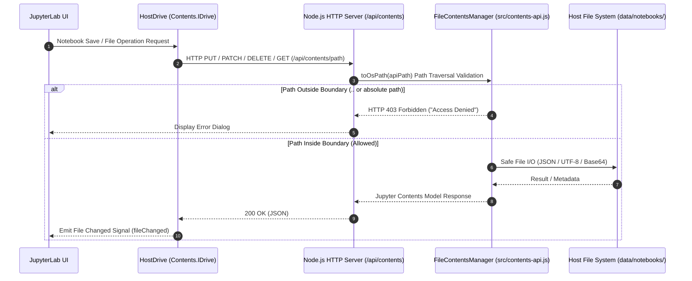

[English](contents-api-and-host-drive.en.md) | [日本語](contents-api-and-host-drive.md)

---
type: Component Specification
title: Contents API & Host Drive Integration Specification
description: Technical specification for Node.js FileContentsManager and Contents.IDrive extension for direct host OS directory binding and security validation.
tags:
  - contents-api
  - host-drive
  - electron
  - jupyterlab
  - security
status: stable
generated:
  by: agent:antigravity
  at: '2026-09-10T00:00:00Z'
---

# Contents API & Host Drive Integration Specification (`src/contents-api.js` & `packages/host-drive-extension`)

This component provides the core architecture to bridge **"secure code execution inside WebAssembly (Pyodide) browser sandbox"** with **"direct file system operations on the host OS (`data/notebooks/`)"**.

It consists of a Node.js REST API delivery layer conforming to the official Jupyter Server `FileContentsManager` specification, paired with a TypeScript frontend JupyterLab extension that substitutes the primary default contents drive.



---

## 1. Node.js Port of `FileContentsManager` (`src/contents-api.js`)

A Node.js implementation port of the official Jupyter Server `FileContentsManager` specification (BSD-3-Clause).

### Security & Path Traversal Prevention
For every file operation request, the `toOsPath` method evaluates and verifies path boundaries against the host root directory (`rootDir` = `data/notebooks/`).

```javascript
toOsPath(apiPath = '') {
  const parts = String(apiPath).split(/[/\\]+/).filter(p => p !== '');
  const osPath = path.resolve(this.rootDir, ...parts);

  const rel = path.relative(this.rootDir, osPath);
  if (rel.startsWith('..') || path.isAbsolute(rel)) {
    const err = new Error(`Access Denied: Path outside root directory (${apiPath})`);
    err.statusCode = 403;
    throw err;
  }
  return osPath;
}
```

* **Boundary Escape Check**: If `path.relative` returns a path starting with `..` or attempts to escape the root directory, a `403 Forbidden` error is thrown immediately.
* **Path Normalization**: All incoming paths with mixed slashes (`sub/../secret.txt`) are resolved via `path.resolve` prior to comparison, effectively eliminating directory traversal vectors.

### Supported Endpoints Specification
The internal Node.js HTTP server (`src/server.js`) routes the following REST endpoints under `/api/contents/*`:

| HTTP Method | API Endpoint Path | Functionality | FCM Method |
| :--- | :--- | :--- | :--- |
| `GET` | `/api/contents/:path*` | Fetch file or directory content model | `get(apiPath, options)` |
| `PUT` | `/api/contents/:path*` | Save/update file, notebook, or directory | `save(model, apiPath)` |
| `POST` | `/api/contents/:path*` | Create new untitled item or copy file | `newUntitled()` / `copy()` |
| `PATCH` | `/api/contents/:path*` | Rename or move file/directory | `rename(oldApiPath, newApiPath)` |
| `DELETE` | `/api/contents/:path*` | Delete file/directory | `delete(apiPath)` |
| `GET/POST/DELETE` | `/api/contents/:path*/checkpoints` | List, create, restore, or delete checkpoints (`.ipynb_checkpoints`) | `listCheckpoints()`, etc. |

---

## 2. Frontend Host Drive Extension (`packages/host-drive-extension`)

Replaces JupyterLab's default in-memory virtual drive (`JupyterLite Drive`) with `HostDrive`, connected directly to the host OS file system via REST endpoints.

### Primary Default Drive Replacement Logic (`src/index.ts`)
```typescript
const hostDrivePlugin: JupyterFrontEndPlugin<void> = {
  id: 'electron-jupyter-sandbox:host-drive-extension',
  autoStart: true,
  requires: [IDocumentManager, IFileBrowserFactory],
  activate: (app: JupyterFrontEnd, docManager: IDocumentManager, factory: IFileBrowserFactory) => {
    const drive = new HostDrive('');
    docManager.services.contents.addDrive(drive);
    (docManager.services.contents as any)._defaultDrive = drive;
    console.log('[HostDrive] Host Contents Drive successfully registered as primary default drive.');
  }
};
```

* **`Contents.IDrive` Implementation**: Implements the standard JupyterLab interface to deliver identical user experience as native JupyterLab Desktop.
* **Real-time Signal Emission**: Emits Lumino signals (`this._fileChanged.emit(...)`) right after save, delete, rename, or create actions, triggering immediate UI file tree updates.

---

## 3. Transparent Synchronization to Pyodide MEMFS

When reading/writing local files within the Python Wasm runtime (Pyodide), `@electron-jupyter-sandbox/preload-extension` coordinates initialization during kernel startup:

1. **Top-Level `await` Preloading**:
   When launching a notebook session, the directory structure of the notebook is automatically mirrored into Pyodide's virtual in-memory file system (MEMFS).
2. **20MB Upper Limit Guard**:
   To prevent Wasm heap memory exhaustion (`OOM / RuntimeError: memory access out of bounds`), files exceeding 20MB are guarded with warning logs directing users to stream or chunk large datasets.

---

## 4. Build and Reflection Steps

Steps to rebuild and apply changes in `packages/host-drive-extension`:

```bash
# 1. Compile JupyterLab extension
npm run build:ext

# 2. Rebuild JupyterLite assets
npm run build:jupyter

# 3. Launch application for testing
npm start
```
