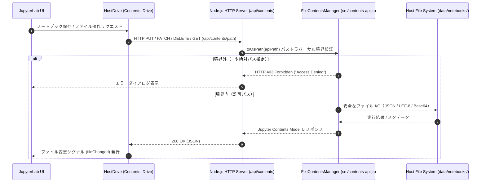

[English](contents-api-and-host-drive.en.md) | [日本語](contents-api-and-host-drive.md)

---
type: Component Specification
title: Contents API と Host Drive 連携仕様
description: Node.js版 FileContentsManager と Contents.IDrive 拡張機能によるホストディレクトリ直接結合とセキュリティ検証の仕様。
tags:
  - contents-api
  - host-drive
  - electron
  - jupyterlab
  - security
status: stable
generated:
  by: agent:antigravity
  at: '2026-09-10T00:00:00Z'
---

# Contents API と Host Drive 連携仕様 (`src/contents-api.js` & `packages/host-drive-extension`)

本コンポーネントは、**「WebAssembly (Pyodide) のブラウザサンドボックスによる安全なコード実行環境」** と **「ローカルPC（ホストOS）のファイルシステム（`data/notebooks/`）の直接操作」** をシームレスかつセキュアに両立させるためのコアアーキテクチャです。

Jupyter Server 公式の `FileContentsManager` 仕様に準拠した REST API 配信層（Node.js）と、JupyterLab のプライマリドライブを差し替えるフロントエンド拡張機能（TypeScript）で構成されています。



---

## 1. Node.js 版 `FileContentsManager` (`src/contents-api.js`)

Jupyter Server 公式の `FileContentsManager` 仕様（BSD-3-Clause）を Node.js に移植したクラスです。

### セキュリティ・パストラバーサル防御ロジック
すべてのファイル操作リクエストにおいて、`toOsPath` 関数を介してホストルートディレクトリ（`rootDir` = `data/notebooks/`）に対する境界チェックを実行します。

```javascript
toOsPath(apiPath = '') {
  const parts = String(apiPath).split(/[/\\]+/).filter(p => p !== '');
  const osPath = path.resolve(this.rootDir, ...parts);

  const rel = path.relative(this.rootDir, osPath);
  if (rel.startsWith('..') || path.isAbsolute(rel)) {
    const err = new Error(`Access Denied: Path outside root directory (${apiPath})`);
    err.statusCode = 403;
    throw err;
  }
  return osPath;
}
```

* **相対パスの境界脱出判定**: `path.relative` の結果が `..` で始まる場合やルート絶対パスを超える指定は即座に `403 Forbidden` を発生させます。
* **正規化処理**: 任意のスラッシュ・バックスラッシュの混在パス（`sub/../secret.txt` 等）を `path.resolve` で解決してから判定するため、ディレクトリトラバーサル攻撃を無効化します。

### サポートするエンドポイント仕様
内部 HTTP サーバー (`src/server.js`) は以下の REST API を `/api/contents/*` でルーティングします：

| HTTP メソッド | API パス | 処理内容 | FCM メソッド |
| :--- | :--- | :--- | :--- |
| `GET` | `/api/contents/:path*` | ファイル/ディレクトリのコンテンツモデル取得 | `get(apiPath, options)` |
| `PUT` | `/api/contents/:path*` | ファイル・ノートブック・フォルダの保存/更新 | `save(model, apiPath)` |
| `POST` | `/api/contents/:path*` | 新規無題作成 (Untitled) または ファイル複製 | `newUntitled()` / `copy()` |
| `PATCH` | `/api/contents/:path*` | ファイル/フォルダのリネーム・移動 | `rename(oldApiPath, newApiPath)` |
| `DELETE` | `/api/contents/:path*` | ファイル/フォルダの削除 | `delete(apiPath)` |
| `GET/POST/DELETE` | `/api/contents/:path*/checkpoints` | チェックポイント (.ipynb_checkpoints) の一覧・作成・復元・削除 | `listCheckpoints()` 等 |

---

## 2. フロントエンド Host Drive 拡張機能 (`packages/host-drive-extension`)

JupyterLab のフロントエンドに標準登録されているメモリ内仮想ドライブ（`JupyterLite Drive`）を、ホストOS直結の `HostDrive` クラスで置換します。

### ドライブラジカル置換ロジック (`src/index.ts`)
```typescript
const hostDrivePlugin: JupyterFrontEndPlugin<void> = {
  id: 'electron-jupyter-sandbox:host-drive-extension',
  autoStart: true,
  requires: [IDocumentManager, IFileBrowserFactory],
  activate: (app: JupyterFrontEnd, docManager: IDocumentManager, factory: IFileBrowserFactory) => {
    const drive = new HostDrive('');
    docManager.services.contents.addDrive(drive);
    (docManager.services.contents as any)._defaultDrive = drive;
    console.log('[HostDrive] Host Contents Drive successfully registered as primary default drive.');
  }
};
```

* **`Contents.IDrive` の実装**: JupyterLab の標準インターフェースを完備し、UI 側からはネイティブの JupyterLab Desktop と同じ使用感を実現します。
* **リアルタイムシグナル発火**: 保存・削除・リネーム・新規作成操作の直後に Lumino シグナル (`this._fileChanged.emit(...)`) を発行し、ファイルツリー UI が即座に自動更新されます。

---

## 3. Pyodide 仮想ファイルシステム (MEMFS) への透過同期

Python Wasm ランタイム (Pyodide) 内からローカルファイルを読み書きする際、`@electron-jupyter-sandbox/preload-extension` がカーネル初期化時に連携します。

1. **Top-Level `await` による初期ロード**:
   Python カーネル起動時、アクティブなノートブックと同じディレクトリ構造が Wasm 上の MEMFS（仮想メモリファイルシステム）へ自動ロードされます。
2. **20MB 上限ガード機能**:
   極端に大きなバイナリファイルやデータセットのロード時に Wasm ヒープ領域（通常 2GB 上限）が枯渇してクラッシュ（`OOM / RuntimeError: memory access out of bounds`）するのを防ぐため、20MB を超えるファイルは警告ログを発行してストリーミングまたは分割処理を誘導します。

---

## 4. ビルドと拡張機能の反映手順

`packages/host-drive-extension` の変更をアプリに反映する手順：

```bash
# 1. ラボ拡張機能のコンパイル
npm run build:ext

# 2. JupyterLite アセットの再生成
npm run build:jupyter

# 3. アプリの起動・検証
npm start
```
