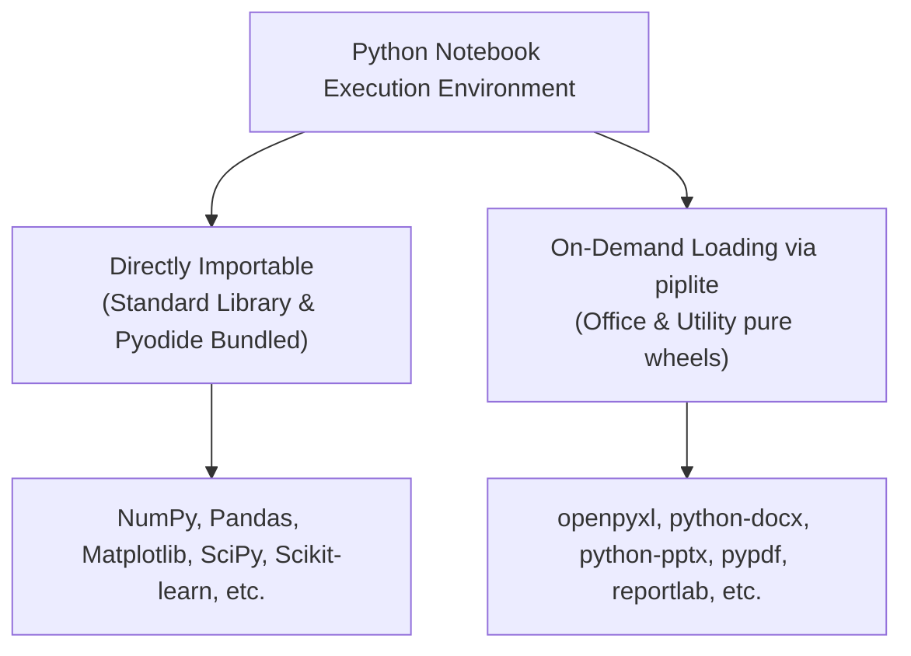

[English](pyodide-kernel.en.md) | [日本語](pyodide-kernel.md)

---
type: Component Specification
title: Pyodide Wasm Kernel & Local Delivery Infrastructure
description: Architecture and specifications of the local bundling and delivery mechanism for the Python WebAssembly runtime.
tags:
  - pyodide
  - wasm
  - jupyterlite
  - kernel
status: stable
generated:
  by: agent:antigravity
  at: '2026-08-30T02:30:00Z'
---

# Pyodide Wasm Kernel & Local Delivery Infrastructure

This sandbox provides a fully offline, locally self-contained Python execution environment running on WebAssembly (Pyodide `314.0.5`) inside the browser worker.
Without any external network access, users can perform tasks ranging from data science to office document processing (Excel, Word, PowerPoint, PDF).

---

## 1. Available Library Ecosystem

In this environment, users can select and persist package preload configurations via the Electron menu bar (`Libraries`). Packages enabled for preloading (e.g., `japanize-noto-sans-jp`, `matplotlib`, `openpyxl`) are automatically imported at kernel startup, allowing direct `import` statements without calling `piplite.install()` in notebook cells.

Additional non-preloaded libraries can be loaded on-demand using `piplite.install()`.



| Category | Usage Method | Key Target Libraries |
| :--- | :--- | :--- |
| **Directly Importable** | `import pandas as pd`<br/>(No extra code required) | Python Standard Library, NumPy, Pandas, Matplotlib, SciPy, Scikit-learn, Seaborn, Pillow, lxml, etc. |
| **On-Demand Loading** | `import piplite`<br/>`await piplite.install(['openpyxl'])`<br/>(Run once at cell top) | openpyxl, xlsxwriter, python-docx, python-pptx, pypdf, reportlab, tabulate, etc. |

---

## 2. Library Quick Reference by Use Case

### 📊 Data Analysis, Computation & Statistics
| Package Name | Loading Method | Capabilities / Purpose | Typical Usage |
| :--- | :--- | :--- | :--- |
| **`pandas`** | Direct `import` | Tabular data manipulation, CSV/Excel I/O, time-series analysis | `import pandas as pd` |
| **`numpy`** | Direct `import` | Multi-dimensional array operations, linear algebra, random numbers | `import numpy as np` |
| **`scipy`** | Direct `import` | Scientific computing, optimization, integration, signal processing | `import scipy` |
| **`statsmodels`**| Direct `import` | Statistical modeling, time-series estimation, hypothesis testing | `import statsmodels.api as sm` |
| **`sympy`** | Direct `import` | Symbolic algebra, analytical equations, calculus | `import sympy as sp` |

### 📈 Plotting & Visualization
| Package Name | Loading Method | Capabilities / Purpose | Typical Usage |
| :--- | :--- | :--- | :--- |
| **`matplotlib`** | Direct `import` | 2D/3D graph plotting (line, scatter, histogram, etc.) | `import matplotlib.pyplot as plt` |
| **`japanize-noto-sans-jp`** | `piplite.install` | **Japanese font tofu fix for Matplotlib**. Applies Google Noto Sans JP (JIS Level 1 subset, 760KB) & native SVG vector text | `import japanize_noto_sans_jp` |
| **`seaborn`** | Direct `import` | Statistical graphic visualization, heatmaps | `import seaborn as sns` |
| **`bokeh`** | Direct `import` | Interactive Web charts | `import bokeh` |
| **`altair`** | Direct `import` | Declarative statistical visualization | `import altair as alt` |

> [!TIP]
> **Japanese Rendering and SVG Vector Architecture**:
> - Default Pyodide runtimes contain only Latin fonts, rendering CJK characters as empty rectangles (tofu □).
> - The included **`japanize-noto-sans-jp`** wheel features Google Fonts **Noto Sans JP** subsetted to JIS Level 1 + common kanji (~3,500 glyphs) in a **760 KB ultra-lightweight wheel**.
> - Importing it sets `svg.fonttype = 'none'`, delegating text glyph rendering to the **Electron browser's native vector font renderer**. This ensures crisp, scaleable vector charts on Retina / 4K displays.

### 📑 Office Document Processing (Excel, Word, PowerPoint, PDF)
| Package Name | Loading Method | Capabilities / Purpose | Typical Usage |
| :--- | :--- | :--- | :--- |
| **`openpyxl`** | `piplite.install` | Read/write Excel (`.xlsx`), formulas, cell formatting | `import openpyxl` |
| **`xlsxwriter`** | `piplite.install` | Fast Excel (`.xlsx`) creation, charts, conditional formats | `import xlsxwriter` |
| **`python-docx`** | `piplite.install` | Create Word (`.docx`) documents, paragraphs, tables, images | `import docx` |
| **`python-pptx`** | `piplite.install` | Generate PowerPoint (`.pptx`) slides, layout manipulation | `import pptx` |
| **`pypdf`** | `piplite.install` | Extract, merge, rotate, encrypt, and extract text from PDFs | `import pypdf` |
| **`reportlab`** | `piplite.install` | Programmatically generate PDF reports and vector graphics | `from reportlab.pdfgen import canvas` |

### 🤖 Machine Learning, Image Processing & Utilities
| Package Name | Loading Method | Capabilities / Purpose | Typical Usage |
| :--- | :--- | :--- | :--- |
| **`scikit-learn`** | Direct `import` | Machine learning (classification, regression, clustering) | `from sklearn.linear_model import LogisticRegression` |
| **`pillow`** | Direct `import` | Image reading, resizing, cropping, filtering | `from PIL import Image` |
| **`tabulate`** | `piplite.install` | Pretty-print list/dict data into text/Markdown tables | `from tabulate import tabulate` |
| **`defusedxml`** | `piplite.install` | Prevent XML bomb vulnerabilities during parsing | `import defusedxml.ElementTree as ET` |
| **`lxml`** / **`beautifulsoup4`** | Direct `import` | HTML/XML document parsing and scraping | `from bs4 import BeautifulSoup` |

---

## 3. Quickstart Code Examples

### Example 1: Data Analysis & Plotting (Noto Sans JP + Native SVG Rendering)
```python
# 1. Install lightweight font package offline
import piplite
await piplite.install(['japanize-noto-sans-jp'])

# 2. Configure figure format to vector SVG
%config InlineBackend.figure_format = 'svg'

# 3. Import libraries (import japanize_noto_sans_jp applies font configuration automatically)
import pandas as pd
import numpy as np
import matplotlib.pyplot as plt
import japanize_noto_sans_jp

# 4. Generate sample data
np.random.seed(42)
df = pd.DataFrame({
    'Month': [f'{i}M' for i in range(1, 13)],
    'Sales': np.random.randint(100, 300, size=12)
})

# 5. Render plot
plt.figure(figsize=(8, 4))
plt.bar(df['Month'], df['Sales'], color='steelblue')
plt.title('Monthly Sales Trend')
plt.xlabel('Month')
plt.ylabel('Sales ($k)')
plt.grid(axis='y', linestyle='--', alpha=0.7)
plt.show()
```

### Example 2: Excel Workbook Generation (`openpyxl`)
```python
import piplite
await piplite.install(['openpyxl'])

import openpyxl

wb = openpyxl.Workbook()
ws = wb.active
ws.title = "Sales Summary"

ws['A1'] = "Category"
ws['B1'] = "Amount"
ws['A2'] = "Hardware"
ws['B2'] = 150000
ws['A3'] = "Software"
ws['B3'] = 80000

wb.save("sample_sales.xlsx")
print("Saved sample_sales.xlsx")
```

---

## 4. Architecture and Delivery Specification

1. **Local Bundling (`jupyterlite/static/pyodide/` & `wheels/`)**
   - Contains Pyodide `314.0.5` runtime, Wasm binaries, standard library, and Pure Python wheels locally.
   - Zero network requests to CDNs (jsdelivr, PyPI, etc.).
2. **Internal HTTP Delivery (`http://127.0.0.1:<port>`)**
   - Served via Node.js internal server.
   - Headers `Cross-Origin-Opener-Policy: same-origin` and `Cross-Origin-Embedder-Policy: require-corp` enable high-performance `SharedArrayBuffer`.
3. **Full MIME Type Support**
   - Correctly serves `.wasm` (`application/wasm`), `.whl` (`application/x-wheel+zip`), and `.mjs` (`application/javascript`).

> For detailed package inventories and license references, see [Bundled Python Packages Reference](../references/bundled-packages.md).
