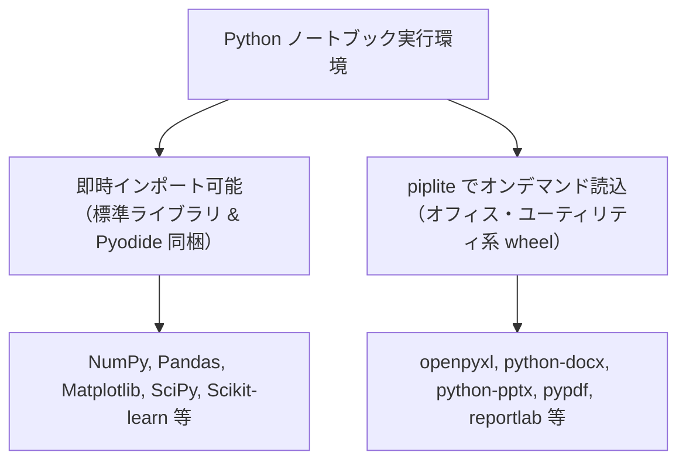

[English](pyodide-kernel.en.md) | [日本語](pyodide-kernel.md)

---
type: Component Specification
title: Pyodide Wasm カーネルとローカル配信基盤
description: WebAssembly上で動作するPython実行環境のローカル同梱・配信基盤の仕様と設計。
tags:
  - pyodide
  - wasm
  - jupyterlite
  - kernel
status: stable
generated:
  by: agent:antigravity
  at: '2026-08-30T02:30:00Z'
---

# Pyodide Wasm カーネルとローカル配信基盤

本サンドボックス環境は、ブラウザ内の WebAssembly (Pyodide `314.0.5`) 上で完全にローカル完結する Python 実行環境を提供します。
外部ネットワークへのアクセスなしで、データサイエンスからオフィスドキュメント操作（Excel, Word, PowerPoint, PDF）まで幅広いタスクを安全に実行できます。

---

## 1. ユーザーが利用できるライブラリ体系

本環境では、Electron メニューバーの「**ライブラリ**」からプリロード対象のパッケージを選択・保存できます。プリロード設定が ON になっているライブラリ（デフォルト: `japanize-noto-sans-jp`, `matplotlib`, `openpyxl` など）はカーネル起動時に自動的に読み込まれるため、セル内で `piplite.install()` を呼び出すことなく、1行目から直接 `import` して利用できます。

未プリロードの追加ライブラリについても、`piplite.install()` でオンデマンド読込が可能です。



| 区分 | 呼び出し方法 | 主な対象ライブラリ |
| :--- | :--- | :--- |
| **即時インポート可能** | `import pandas as pd`<br/>（追加コード不要） | Python 標準ライブラリ全般、NumPy, Pandas, Matplotlib, SciPy, Scikit-learn, Seaborn, Pillow, lxml 等 |
| **オンデマンド読込** | `import piplite`<br/>`await piplite.install(['openpyxl'])`<br/>（セルの先頭で1回実行） | openpyxl, xlsxwriter, python-docx, python-pptx, pypdf, reportlab, tabulate 等 |

---

## 2. 目的別・使えるライブラリ逆引き一覧

ユーザーのユースケース（やりたいこと）ごとに利用可能なパッケージの一覧です。

### 📊 データ分析・数値計算・統計
| パッケージ名 | 読込方法 | できること・用途 | 代表的な使い方 |
| :--- | :--- | :--- | :--- |
| **`pandas`** | そのまま `import` | 表形式データの集計、CSV/Excel読み書き、時系列解析 | `import pandas as pd` |
| **`numpy`** | そのまま `import` | 多次元配列演算、線形代数、乱数生成、高速計算 | `import numpy as np` |
| **`scipy`** | そのまま `import` | 科学技術計算、最適化、積分、信号処理、統計検定 | `import scipy` |
| **`statsmodels`** | そのまま `import` | 統計モデルの推定、時系列分析、仮説検定 | `import statsmodels.api as sm` |
| **`sympy`** | そのまま `import` | 記号代数、方程式の解析解、微積分計算 | `import sympy as sp` |

### 📈 グラフ・可視化
| パッケージ名 | 読込方法 | できること・用途 | 代表的な使い方 |
| :--- | :--- | :--- | :--- |
| **`matplotlib`** | そのまま `import` | 2D/3D グラフ描画（折れ線、散布図、ヒストグラム等） | `import matplotlib.pyplot as plt` |
| **`japanize-noto-sans-jp`** | `piplite.install` | **Matplotlibの日本語豆腐解消**。Google Noto Sans JP（JIS第1水準サブセット・760KB）を自動適用＆SVGネイティブ描画設定 | `import japanize_noto_sans_jp` |
| **`seaborn`** | そのまま `import` | 統計データの美しいグラフィック可視化、ヒートマップ | `import seaborn as sns` |
| **`bokeh`** | そのまま `import` | インタラクティブな Web チャート生成 | `import bokeh` |
| **`altair`** | そのまま `import` | 宣言的な統計ビジュアライゼーション | `import altair as alt` |

> [!TIP]
> **Matplotlib の日本語描画と SVG アーキテクチャ**:
> - Pyodide のデフォルト環境には欧文フォントのみが含まれるため、そのまま日本語を描画すると豆腐（□）になります。
> - 同梱の **`japanize-noto-sans-jp`** は、Google Fonts の標準フォント **Noto Sans JP** を JIS第1水準＋常用漢字（約3,500字）に厳選サブセット化した**わずか 760 KB の超軽量 wheel** です（IPAex等と比べ約 80% 軽量）。
> - インポート時に `svg.fonttype = 'none'` が自動設定されるため、SVG 描画時は文字をパス化せず、**Electron / ブラウザネイティブの美麗なフォントレンダラーに描画が委ねられます**。これにより Retina / 4K ディスプレイでも極めて美しく、拡大してもボケないベクターグラフが得られます。

### 📑 オフィスドキュメント操作（Excel・Word・PowerPoint・PDF）
| パッケージ名 | 読込方法 | できること・用途 | 代表的な使い方 |
| :--- | :--- | :--- | :--- |
| **`openpyxl`** | `piplite.install` | Excel (`.xlsx`) の読み込み・編集・数式設定・セル書式設定 | `import openpyxl` |
| **`xlsxwriter`** | `piplite.install` | Excel (`.xlsx`) の高速新規作成、グラフ・条件付き書式 | `import xlsxwriter` |
| **`python-docx`** | `piplite.install` | Word (`.docx`) の新規作成、段落・表・画像の挿入と書式設定 | `import docx` |
| **`python-pptx`** | `piplite.install` | PowerPoint (`.pptx`) スライドの自動作成・レイアウト編集 | `import pptx` |
| **`pypdf`** | `piplite.install` | 既存 PDF のページ抽出・結合・回転・暗号化・テキスト取得 | `import pypdf` |
| **`reportlab`** | `piplite.install` | PDF 帳票・図形・テキストの直接描画・レポート出力 | `from reportlab.pdfgen import canvas` |

### 🤖 機械学習・画像処理・ユーティリティ
| パッケージ名 | 読込方法 | できること・用途 | 代表的な使い方 |
| :--- | :--- | :--- | :--- |
| **`scikit-learn`** | そのまま `import` | 機械学習（分類、回帰、クラスタリング、次元削減） | `from sklearn.linear_model import LogisticRegression` |
| **`pillow`** | そのまま `import` | 画像の読み込み、リサイズ、トリミング、フィルタ処理 | `from PIL import Image` |
| **`tabulate`** | `piplite.install` | リストや辞書のデータをきれいなテキスト/Markdown表に変換 | `from tabulate import tabulate` |
| **`defusedxml`** | `piplite.install` | XML 爆弾等の攻撃を防ぎ安全に XML データを処理 | `import defusedxml.ElementTree as ET` |
| **`lxml`** / **`beautifulsoup4`** | そのまま `import` | HTML/XML ドキュメントの解析・パース | `from bs4 import BeautifulSoup` |

---

## 3. クイックスタート・利用コード例

### 例1: データ分析とグラフ作成（超軽量 Noto Sans JP + SVG ネイティブ描画）
```python
# 1. 超軽量 Google 日本語フォントパッケージをオフラインインストール
import piplite
await piplite.install(['japanize-noto-sans-jp'])

# 2. グラフ表示をベクターSVG形式に設定（Electron側で超高精細・ネイティブ描画）
%config InlineBackend.figure_format = 'svg'

# 3. パッケージをインポート（import japanize_noto_sans_jp でフォントとSVG設定が自動適用）
import pandas as pd
import numpy as np
import matplotlib.pyplot as plt
import japanize_noto_sans_jp

# 4. データの作成
np.random.seed(42)
df = pd.DataFrame({
    '月': [f'{i}月' for i in range(1, 13)],
    '売上': np.random.randint(100, 300, size=12)
})

# 5. グラフ描画（日本語が豆腐にならず、Electronのネイティブフォントで鮮明に表示されます）
plt.figure(figsize=(8, 4))
plt.bar(df['月'], df['売上'], color='steelblue')
plt.title('月別売上推移')
plt.xlabel('年月')
plt.ylabel('売上 (万円)')
plt.grid(axis='y', linestyle='--', alpha=0.7)
plt.show()
```

### 例2: Excel ワークブックの作成（openpyxl）
```python
import piplite
await piplite.install(['openpyxl'])

import openpyxl

wb = openpyxl.Workbook()
ws = wb.active
ws.title = "売上集計"

ws['A1'] = "項目"
ws['B1'] = "金額"
ws['A2'] = "ハードウェア"
ws['B2'] = 150000
ws['A3'] = "ソフトウェア"
ws['B3'] = 80000

wb.save("sample_sales.xlsx")
print("sample_sales.xlsx を保存しました")
```

### 例3: PDF レポートの自動生成（ReportLab）
```python
import piplite
await piplite.install(['reportlab'])

from reportlab.lib.pagesizes import letter
from reportlab.pdfgen import canvas

c = canvas.Canvas("report.pdf", pagesize=letter)
c.setFont("Helvetica-Bold", 16)
c.drawString(72, 720, "Offline Pyodide Report")
c.setFont("Helvetica", 12)
c.drawString(72, 690, "Generated completely offline inside JupyterLite.")
c.save()
print("report.pdf を生成しました")
```

---

## 4. アーキテクチャと配信仕様（技術的詳細）

本環境が完全オフラインで動作するための内部配信設計です。

1. **完全ローカル同梱 (`jupyterlite/static/pyodide/` & `wheels/`)**
   - Pyodide `314.0.5` ランタイム、Wasm バイナリ、標準ライブラリ、および Pure Python wheel をすべてローカルに内包。
   - 外部 CDN（jsdelivr や PyPI 等）へのネットワークリクエストは行いません。
2. **内部 HTTP 配信サーバー (`http://127.0.0.1:<port>`)**
   - Node.js の内部サーバー経由でセキュアに配信。
   - `Cross-Origin-Opener-Policy: same-origin` および `Cross-Origin-Embedder-Policy: require-corp` を付与し、`SharedArrayBuffer` による高速実行を担保。
3. **MIME タイプの完全サポート**
   - `.wasm` (`application/wasm`)、`.whl` (`application/x-wheel+zip`)、`.mjs` (`application/javascript`) を正しく配信。

> 詳細なパッケージ一覧やハッシュ・ライセンス情報については [同梱 Python パッケージ一覧・ライセンスリファレンス](../references/bundled-packages.md) を参照してください。
