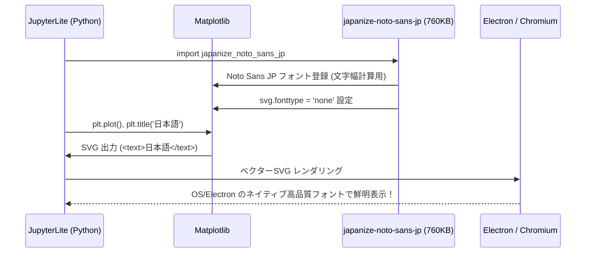

# 日本語データ可視化＆ドキュメント操作 実践コードレシピ集

本環境は外部ネットワークから完全に遮断された閉空間で動作しますが、**超軽量 Google Noto Sans JP サブセット（760KB）** と **SVG による Electron ネイティブ描画** の組み合わせにより、追加の外部通信なしで極めて美麗な日本語グラフ描画やオフィス帳票処理を行えます。

---

## 描画アーキテクチャの要点



- **超軽量 (760KB)**: JIS第1水準＋常用漢字（計3,584字）を厳選サブセット化し、高速なロードを実現。
- **SVG ネイティブ描画**: 文字をパス（アウトライン）に変換せず `<text>` タグとして出力するため、Retina / 4K ディスプレイでも拡大縮小で一切ボケません。
- **文字幅の正確性**: Python 側にもフォントメトリクスが存在するため、軸や凡例のレイアウト崩れや警告が出ません。

---

## 実践コードレシピ集

### レシピ 1: 基本の日本語グラフ描画（棒グラフ & 折れ線グラフ）

タイトル、軸ラベル、凡例、グリッドを含む標準的な月別売上・利益グラフです。

```python
# 1. パッケージのオフラインロード (初回のみ)
import piplite
await piplite.install(['japanize-noto-sans-jp'])

# 2. SVG 描画設定（超高精細・ネイティブレンダリング）
%config InlineBackend.figure_format = 'svg'

# 3. インポート（フォントとSVG設定が自動適用）
import pandas as pd
import numpy as np
import matplotlib.pyplot as plt
import japanize_noto_sans_jp

# 4. サンプルデータの作成
np.random.seed(42)
months = [f"{i}月" for i in range(1, 13)]
sales = np.random.randint(200, 450, size=12)
profit = sales * np.random.uniform(0.2, 0.35, size=12)

# 5. 複合グラフの描画
fig, ax1 = plt.subplots(figsize=(9, 4.5))

# 売上（棒グラフ）
color_bar = '#4A90E2'
ax1.set_xlabel('年月度', fontsize=11)
ax1.set_ylabel('売上高 (万円)', color=color_bar, fontsize=11)
bars = ax1.bar(months, sales, color=color_bar, alpha=0.7, label='売上高')
ax1.tick_params(axis='y', labelcolor=color_bar)
ax1.grid(axis='y', linestyle='--', alpha=0.5)

# 利益（折れ線グラフ）
ax2 = ax1.twinx()
color_line = '#E94E77'
ax2.set_ylabel('営業利益 (万円)', color=color_line, fontsize=11)
ax2.plot(months, profit, color=color_line, marker='o', linewidth=2.5, label='営業利益')
ax2.tick_params(axis='y', labelcolor=color_line)

# タイトル
plt.title('2026年度 月別売上高および営業利益推移', fontsize=14, pad=12)
fig.tight_layout()
plt.show()
```

---

### レシピ 2: Seaborn による統計データ可視化とヒートマップ

Seaborn のテーマを適用しつつ、日本語フォントを維持するパターンです。

```python
import piplite
await piplite.install(['japanize-noto-sans-jp'])
%config InlineBackend.figure_format = 'svg'

import seaborn as sns
import numpy as np
import pandas as pd
import matplotlib.pyplot as plt
import japanize_noto_sans_jp

# 相関行列のサンプルデータ作成
np.random.seed(0)
columns = ['顧客満足度', 'リピート率', '売上金額', 'Web滞在時間', '問い合わせ数']
data = np.random.rand(5, 5)
corr = np.corrcoef(data)
df_corr = pd.DataFrame(corr, index=columns, columns=columns)

# ヒートマップ描画
plt.figure(figsize=(7, 5.5))
sns.heatmap(df_corr, annot=True, cmap='Blues', fmt=".2f", cbar=True)
plt.title('主要ビジネス指標の相関マトリクス', fontsize=13, pad=10)
plt.show()
```

---

### レシピ 3: Excel データの集計とグラフ連携（openpyxl + Pandas）

Excel ワークブックを新規作成し、そのデータを読み込んで日本語グラフを作成する一連の流れです。

```python
import piplite
await piplite.install(['openpyxl', 'japanize-noto-sans-jp'])
%config InlineBackend.figure_format = 'svg'

import openpyxl
import pandas as pd
import matplotlib.pyplot as plt
import japanize_noto_sans_jp

# 1. Excel ファイルの作成 (openpyxl)
wb = openpyxl.Workbook()
ws = wb.active
ws.title = "支店別実績"

ws.append(["支店名", "成約数", "売上高(百万円)"])
ws.append(["東京本社", 142, 380])
ws.append(["大阪支店", 98, 240])
ws.append(["名古屋支店", 65, 160])
ws.append(["福岡支店", 51, 120])
ws.append(["札幌支店", 34, 85])

excel_filename = "branch_sales.xlsx"
wb.save(excel_filename)
print(f"Excel ファイル保存完了: {excel_filename}")

# 2. Pandas で読み込み・集計
df = pd.read_excel(excel_filename)

# 3. グラフ描画
plt.figure(figsize=(8, 4))
plt.barh(df["支店名"], df["売上高(百万円)"], color="forestgreen")
plt.title("2026年 支店別売上高実績", fontsize=13)
plt.xlabel("売上高 (百万円)", fontsize=11)
plt.ylabel("拠点", fontsize=11)
plt.grid(axis='x', linestyle=':', alpha=0.6)
plt.gca().invert_yaxis()  # 上位を上に配置
plt.tight_layout()
plt.show()
```

---

### レシピ 4: PDF レポート生成（ReportLab）

完全オフラインで PDF レポートを作成し、テーブルやテキストを配置するレシピです。

```python
import piplite
await piplite.install(['reportlab'])

from reportlab.lib.pagesizes import A4
from reportlab.pdfgen import canvas
from reportlab.platypus import SimpleDocTemplate, Paragraph, Spacer, Table, TableStyle
from reportlab.lib.styles import getSampleStyleSheet
from reportlab.lib import colors

# PDF テンプレート作成
pdf_file = "monthly_report.pdf"
doc = SimpleDocTemplate(pdf_file, pagesize=A4)
story = []
styles = getSampleStyleSheet()

# タイトル
story.append(Paragraph("<b>Monthly Executive Report</b>", styles['Title']))
story.append(Spacer(1, 15))

# テーブルデータ
table_data = [
    ["Department", "Target", "Actual", "Achievement Rate"],
    ["Enterprise Sales", "100 M", "118 M", "118%"],
    ["SMB Sales", "60 M", "64 M", "106%"],
    ["Consulting", "40 M", "38 M", "95%"],
    ["Support / Maintenance", "30 M", "32 M", "106%"],
]

t = Table(table_data, colWidths=[150, 80, 80, 110])
t.setStyle(TableStyle([
    ('BACKGROUND', (0, 0), (-1, 0), colors.HexColor('#2C3E50')),
    ('TEXTCOLOR', (0, 0), (-1, 0), colors.whitesmoke),
    ('ALIGN', (0, 0), (-1, -1), 'CENTER'),
    ('FONTNAME', (0, 0), (-1, 0), 'Helvetica-Bold'),
    ('BOTTOMPADDING', (0, 0), (-1, 0), 8),
    ('GRID', (0, 0), (-1, -1), 0.5, colors.grey),
]))

story.append(t)
doc.build(story)
print(f"PDF レポート生成完了: {pdf_file}")
```

---

## よくある質問 & トラブルシューティング

### Q1. なぜ `%config InlineBackend.figure_format = 'svg'` を推奨するのですか？
PNG（ラスター画像）と違い、SVG（ベクター画像）はディスプレイの解像度に合わせて文字や線を常に最高画質でレンダリングします。また文字情報をそのまま保持するため、グラフ内のテキストを選択・コピーすることも可能です。

### Q2. グラフ画像を PNG 形式でディスクに保存したい場合はどうしますか？
`plt.savefig('output.png', dpi=300)` で問題なく保存できます。`japanize_noto_sans_jp` のフォントファイル（760KB）が Python 内部に登録されているため、PNG 画像に変換する際も日本語文字が豆腐にならず正常に出力されます。

### Q3. 人名など非常に珍しい旧字体漢字が文字化けしますか？
本パッケージは **JIS第1水準（2,965字）＋常用漢字** を収録しています。一般的なビジネス単語、売上科目、都道府県名、一般的な人名は 100% 網羅されています。もし極めて稀少な漢字が必要な場合は、SVG 形式（`figure_format = 'svg'`）で出力すれば、描画自体は OS 側のフォントが使われるため正しく表示されます。
