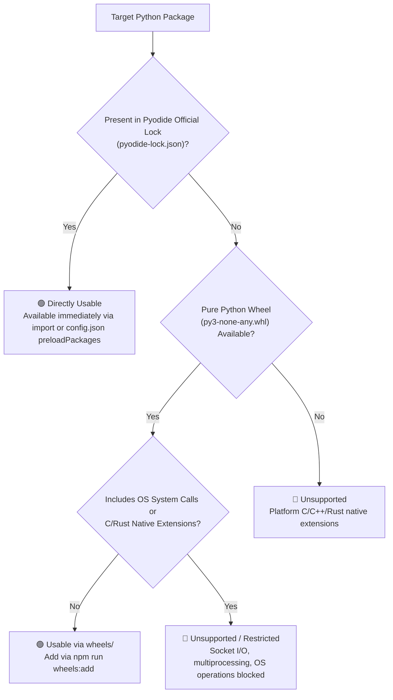

[English](offline-wheels.en.md) | [日本語](offline-wheels.md)

---
type: Playbook
title: Fully Offline Wheel Bundling Guide
description: Procedures for pre-downloading Python packages (.whl) for air-gapped environment bundling in JupyterLite.
tags:
  - wheels
  - offline
  - pip
  - playbook
status: stable
generated:
  by: agent:antigravity
  at: '2026-09-09T11:30:00Z'
---

# Fully Offline Wheel Bundling Guide

Procedure for adding and bundling custom Python packages for air-gapped PC deployments.

## 1. Automated Script Management (Recommended)

### Batch Preset Download

Download office suite packages (Excel, Word, PowerPoint, PDF support) in one command:

```bash
npm run wheels:preset:office
```

Included packages: openpyxl, xlsxwriter, python-docx, python-pptx, pypdf, tabulate, reportlab, defusedxml

### Download Individual Packages

```bash
# Download specified package with automatic dependency resolution
npm run wheels:add -- openpyxl python-docx

# Dry run (checks dependencies without downloading)
npm run wheels:add -- openpyxl --dry-run

# Clean download (clears existing wheel cache prior to download)
npm run wheels:add -- --clean --preset office
```

### Script Capabilities

- **Recursive Dependency Resolution**: Parses `requires_dist` from PyPI API and downloads dependencies automatically.
- **Pyodide Exclusions**: Reads `pyodide-lock.json` and skips packages already built into Pyodide (356 packages like numpy, pandas, lxml).
- **SHA256 Hash Verification**: Verifies integrity post-download.
- **Manifest Generation**: Records package inventory and dependency tree in `wheels/manifest.json`.

### Vulnerability Auditing

```bash
# Audit wheel dependencies via pip-audit
npm run wheels:audit
```

### Post-Build Integrity Verification

```bash
# Rebuild JupyterLite
npm run build:jupyter

# Verify wheels are correctly included in build output
npm run wheels:verify
```

## 2. Manual Wheel Placement

You can manually place Pure Python wheels (`py3-none-any.whl`) or Wasm-compatible `.whl` files into the `wheels/` directory.

```bash
mkdir -p wheels
# Example: downloading openpyxl manually
python3 -c "
import urllib.request, json
for pkg in ['openpyxl', 'et_xmlfile']:
    req = urllib.request.Request(f'https://pypi.org/pypi/{pkg}/json', headers={'User-Agent': 'Python'})
    with urllib.request.urlopen(req) as resp:
        data = json.loads(resp.read())
        whls = [u for u in data['urls'] if u['filename'].endswith('any.whl')]
        if whls:
            urllib.request.urlretrieve(whls[-1]['url'], f'wheels/{whls[-1][\"filename\"]}')
"
```

## 3. Rebuild and Deployment

```bash
npm run build:jupyter
```

Wheels are registered with `piplite`, enabling immediate offline execution of `%pip install openpyxl` or `import openpyxl`.

## 4. Library Compatibility Rules (Supported vs Unsupported)

Because JupyterLite (Pyodide) runs inside a WebAssembly (WASM) browser sandbox, clear boundaries exist regarding library compatibility.



---

### 🟢 1. Pre-Bundled Packages (Ready Out-of-the-Box)

No setup required. Use directly via `import`:

* **Pyodide Standard**: `numpy`, `pandas`, `matplotlib`, `scipy`, `scikit-learn`, `sympy`, `beautifulsoup4`, `altair`, `networkx`, `tqdm`, `jinja2`, `python-dateutil`, `lxml`, `pillow`, etc.
* **App `wheels/` Pre-Bundled**: `openpyxl`, `xlsxwriter`, `python-docx`, `python-pptx`, `pypdf`, `reportlab`, `tabulate`, `defusedxml`, `japanize-noto-sans-jp`

---

### 📦 2. Recommended Additional Libraries

Pure Python packages easily addable via `npm run wheels:add`:

| Category | Package Name | Capabilities & Benefits |
| :--- | :--- | :--- |
| **Japanese Text Analysis** | `janome` | Pure Python morphological analyzer with built-in dictionary. Performs tokenization offline. |
| **Statistical Visualization** | `seaborn` | Matplotlib-based statistical graphics and heatmaps. |
| **Markdown Parsing** | `markdown` | Parses Markdown text into HTML / structured elements. |
| **Enhanced CSS Search** | `soupsieve` | Modern CSS selector engine for BeautifulSoup4. |
| **Image EXIF Metadata** | `piexif` | Reads, writes, and scrubs EXIF metadata offline. |

---

### 🔴 Unsupported / Restricted Packages

| Package Example | Reason | Workaround / Notes |
| :--- | :--- | :--- |
| **`torch` (PyTorch), `tensorflow`** | Heavy native C++/CUDA binaries | Use `onnxruntime-web` or `scikit-learn` for lightweight ML |
| **`polars` (native build)** | Compiled Rust platform-specific binary | Use `pandas` or official Pyodide WASM builds |
| **`cv2` (opencv-python)** | C++ native image processing | Use `pillow` (Pillow is compiled for WASM and bundled) |
| **`multiprocessing`** | OS process spawning (`fork`/`spawn`) blocked in browser | Refactor with `asyncio` or single-thread execution |
| **`socket`, `requests`** (Direct) | Raw TCP/UDP sockets unavailable | Use `pyodide.http.pyfetch` (When external HTTP network is enabled) |
| **`tkinter`, `PyQt`, `wxPython`** | OS GUI rendering APIs unavailable | Use JupyterLab UI (`ipywidgets` / HTML / SVG) |

---

## 5. Workflow Summary for Adding Packages

1. **Verify Pure Python Wheel Compatibility**:
   ```bash
   npm run wheels:add -- janome beautifulsoup4 jinja2 --dry-run
   ```
2. **Download & Register in Manifest**:
   ```bash
   npm run wheels:add -- janome beautifulsoup4 jinja2
   ```
3. **Audit Security Vulnerabilities**:
   ```bash
   npm run wheels:audit
   ```
4. **Rebuild JupyterLite**:
   ```bash
   npm run build:jupyter
   ```
5. **Verify Build Integrity**:
   ```bash
   npm run wheels:verify
   ```
