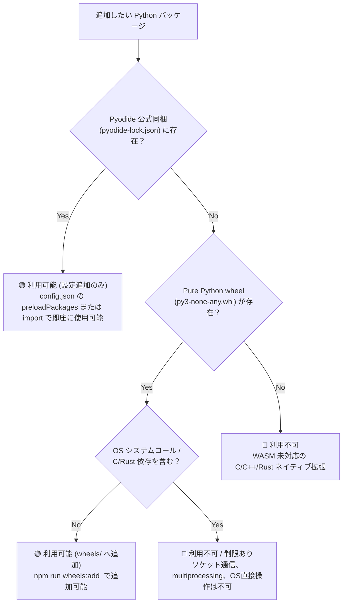

# 完全オフライン Wheel 追加手順書

閉空間（エアギャップPC）向けに独自の Python パッケージを追加同梱する手順です。

## 1. 自動化スクリプトによる追加（推奨）

### プリセットで一括追加

オフィス系パッケージ（Excel/Word/PowerPoint/PDF対応）を一括ダウンロード:

```bash
npm run wheels:preset:office
```

含まれるパッケージ: openpyxl, xlsxwriter, python-docx, python-pptx, pypdf, tabulate, reportlab, defusedxml

### 個別パッケージの追加

```bash
# パッケージ名を指定してダウンロード（依存関係は自動解決）
npm run wheels:add -- openpyxl python-docx

# ドライラン（ダウンロードせず依存関係のみ確認）
npm run wheels:add -- openpyxl --dry-run

# クリーンダウンロード（既存ファイルをクリアしてから再ダウンロード）
npm run wheels:add -- --clean --preset office
```

### スクリプトの機能

- **依存関係の再帰解決**: PyPI API から `requires_dist` を解析し、必要な依存パッケージも自動ダウンロード
- **Pyodide 同梱パッケージの自動除外**: `pyodide-lock.json` を読み込み、Pyodide 本体に含まれるパッケージ（numpy, pandas, lxml 等 356 件）は自動的にスキップ
- **SHA256 ハッシュ検証**: ダウンロード後に整合性を検証
- **マニフェスト生成**: `wheels/manifest.json` にパッケージ一覧と依存関係ツリーを記録

### 脆弱性チェック

```bash
# pip-audit による脆弱性チェック
npm run wheels:audit
```

### ビルド後の整合性検証

```bash
# JupyterLite を再ビルド
npm run build:jupyter

# wheel がビルド出力に正しく反映されたか検証
npm run wheels:verify
```

## 2. 手動による追加

`wheels/` ディレクトリに Pure Python (`py3-none-any.whl`) または Wasm 対応の `.whl` を手動配置することも可能です。

```bash
mkdir -p wheels
# 例: openpyxl のダウンロード
python3 -c "
import urllib.request, json
for pkg in ['openpyxl', 'et_xmlfile']:
    req = urllib.request.Request(f'https://pypi.org/pypi/{pkg}/json', headers={'User-Agent': 'Python'})
    with urllib.request.urlopen(req) as resp:
        data = json.loads(resp.read())
        whls = [u for u in data['urls'] if u['filename'].endswith('any.whl')]
        if whls:
            urllib.request.urlretrieve(whls[-1]['url'], f'wheels/{whls[-1][\"filename\"]}')
"
```

## 3. ビルドと反映

```bash
npm run build:jupyter
```

これで `jupyterlite` 内の `piplite` にホイールが登録され、オフライン下で `%pip install openpyxl` や `import openpyxl` が即座に動作します。

## 4. 追加ライブラリの動作可否（利用できるもの／できないもの）

JupyterLite（Pyodide）はブラウザの WebAssembly (WASM) サンドボックス内で動作するため、**利用できるパッケージと利用できないパッケージの明確な境界** が存在します。



---

### 🟢 利用可能なパッケージ（追加推奨）

| 分類 | パッケージ名 | 特徴・用途 | 同梱 / 追加種別 |
| :--- | :--- | :--- | :--- |
| **日本語処理** | `janome` | Pure Python の日本語形態素解析エンジン（辞書内蔵）。オフラインで分かち書きやテキストマイニングが可能。 | `wheels/` 追加可能 |
| **テキスト解析** | `beautifulsoup4` | HTML/XML スクレイピング・パース。 | Pyodide 同梱 / `wheels/` |
| **テンプレート** | `jinja2`, `markupsafe` | HTML/Markdown/設定ファイルのテンプレート自動生成。 | `wheels/` 追加可能 |
| **ドキュメント** | `markdown`, `python-docx`, `openpyxl` | Markdown 変換、Word/Excel 操作。 | `wheels/` 追加可能 |
| **数式・代数** | `sympy`, `mpmath` | 記号代数、微分積分、方程式求解、高精度計算。 | Pyodide 同梱 |
| **ネットワーク** | `networkx` | グラフ理論、ネットワーク構造解析、最短経路探索。 | `wheels/` 追加可能 |
| **可視化・統計** | `seaborn`, `altair` | 統計グラフ描画、宣言的ベクター可視化。 | Pyodide 同梱 / `wheels/` |
| **ユーティリティ** | `tqdm`, `python-dateutil` | プログレスバー表示、高機能日付・時刻計算。 | `wheels/` 追加可能 |

---

### 🔴 利用できない・制限のあるパッケージ

| パッケージ例 | 動作しない理由 | 代替策・備考 |
| :--- | :--- | :--- |
| **`torch` (PyTorch), `tensorflow`** | WASM 未対応の巨大な C++/CUDA ネイティブバイナリ | 軽量モデルであれば `onnxruntime-web` や `scikit-learn` を使用 |
| **`polars` (ネイティブ版)** | Rust でコンパイルされたプラットフォーム固有バイナリ | `pandas` または Pyodide 公式 WASM ビルド版を使用 |
| **`cv2` (opencv-python)** | C++ ネイティブ画像処理ライブラリ | `pillow` (Pillow は Pyodide に WASM 最適化済みで同梱) |
| **`cryptography` (一部機能)** | OpenSSL / Rust C-FFI バインディング | Pure Python 暗号ライブラリまたは標準 `hashlib` |
| **`multiprocessing`** | OS プロセス生成 (`fork`/`spawn`) がブラウザサンドボックスで禁止 | `asyncio` やシングルスレッド処理に書き換え |
| **`socket`, `requests`** (直接通信) | ブラウザは生 TCP/UDP ソケットを持たない | `pyodide.http.pyfetch` (HTTP通信許可時のみ) |
| **`tkinter`, `PyQt`, `wxPython`** | OS ネイティブ GUI ウィンドウ描画 API が存在しない | JupyterLab の UI (ipywidgets / HTML / SVG) を利用 |

---

## 5. 新規パッケージの追加手順まとめ

1. **Pure Python wheel の確認**:
   ```bash
   # ドライランで依存関係と wheel 形式を事前チェック
   npm run wheels:add -- janome beautifulsoup4 jinja2 --dry-run
   ```
2. **ダウンロードとマニフェスト登録**:
   ```bash
   npm run wheels:add -- janome beautifulsoup4 jinja2
   ```
3. **脆弱性監査**:
   ```bash
   npm run wheels:audit
   ```
4. **JupyterLite の再ビルド**:
   ```bash
   npm run build:jupyter
   ```
5. **整合性検証**:
   ```bash
   npm run wheels:verify
   ```

