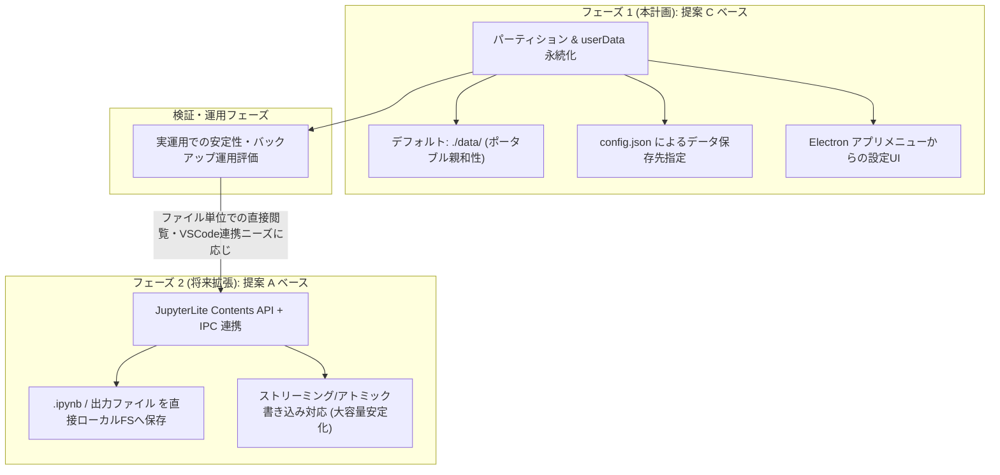

# コード・出力物の永続化：段階的実装計画書

## 1. 永続化ロードマップ全体像

本プロジェクトにおけるコードおよび出力物の永続化は、リスクを最小化しつつ素早く安定した環境を届けるため、以下の2段階アプローチを採用します。



---

## 2. フェーズ 1 詳細計画（提案 C ベースの永続化 & 設定UI）

### 2.1 目的とゴール
- **データ消失ゼロ**: アプリの再起動やバージョンアップ、キャッシュクリアで作成したノートブックや出力が消失しないようにする。
- **ポータブル性**: デフォルトでアプリケーション実行ディレクトリ直下の `./data/` 配下にデータを保存し、フォルダごとのバックアップ・移動を容易にする。
- **柔軟な設定**: ユーザーが Electron メニューから任意の保存先ディレクトリを選択・変更できるようにする。
- **安全性の維持**: WebAssembly (Pyodide) 実行環境の完全隔離と外部通信遮断を完全に維持する。

---

### 2.2 設計仕様

#### ① 保存先ディレクトリ解決ロジック (`dataDir`)
1. 実行環境に応じた設定ファイル `config.json` を参照：
   - パッケージ版 / 開発版ともに、プロジェクトルートまたは実行バイナリ同階層から探索。
2. `config.json` 内の `dataDir` を解決（相対パスは実行ディレクトリを基準に絶対パス化）。
3. 指定がない場合のデフォルト:
   - 開発時 / ポータブル環境: `<project_root>/data`
4. ディレクトリが存在しない場合は自動作成 (`fs.mkdirSync(resolvedDataDir, { recursive: true })`)。
5. `app.setPath('userData', resolvedDataDir)` を `app.whenReady()` の前（アプリ起動初期）に実行。

#### ② 設定ファイルフォーマット (`config.json`)
```json
{
  "dataDir": "./data"
}
```

#### ③ Electron アプリケーションメニューの拡張
- メニューバーに「**設定 (Settings)**」メニューを追加：
  - **「データ保存先フォルダを変更...」**: フォルダ選択ダイアログを開き、`config.json` を更新して再起動プロンプトを表示。
  - **「データ保存先フォルダを開く (OSエクスプローラー)」**: 現在の保存先フォルダを直接開く。
  - **「Jupyter設定ファイルを開く (overrides.json)」**: デフォルトテーマやキーマップなどの設定ファイルを直接編集。
  - **「Jupyter設定フォルダを開く」**: `dataDir/settings/` をファイルマネージャーで開く。
- メニューバー「**ヘルプ (Help)**」の強化：
  - **「ログファイルを開く (app.log)」**: `dataDir/logs/app.log` を直接開く。
  - **「ログフォルダを開く」**: `dataDir/logs/` をファイルマネージャーで開く。
  - **「バージョン・環境情報」**: データ保存先およびログ保存先パスを表示。

#### ④ ログファイルおよびJupyter設定の保存先体系
- **ログファイル**: `dataDir/logs/app.log` に自動保存。
- **Jupyter 設定 (UI操作)**: JupyterLab の Settings Editor から変更したテーマやフォントサイズは、同一オリジン（`58888`）の IndexedDB / Local Storage に自動永続化。
- **Jupyter デフォルト上書き設定 (ファイル定義)**: `dataDir/settings/overrides.json` に記述された設定が起動時に `jupyter-lite.json` に動的マージされ、即座に反映。

#### ⑤ BrowserWindow とセッションの設定
- `DEFAULT_PORT = 58888` による固定ポート化で、同一オリジンを維持（IndexedDB永続化の確実化）。
- `app.requestSingleInstanceLock()` による二重起動防止。
- `webPreferences` に `partition: 'persist:jupyter-data'` を設定し、IndexedDB/LocalStorage の永続化を明示。
- 既存のネットワーク完全隔離フィルター (`session.defaultSession` およびカスタムパーティションセッション) を適用。

---

### 2.3 変更対象ファイル一覧

| 種別 | ファイルパス | 変更概要 |
|---|---|---|
| 修正 | [src/main.js](file:///home/nobuhiko/Project/electron-jupyter-sandbox/src/main.js) | `config.json` 読み書き、`app.setPath('userData')` 設定、アプリケーションメニュー定義 (`Menu.setApplicationMenu`)、再起動ダイアログ・フォルダを開く処理追加 |
| 修正 | [.gitignore](file:///home/nobuhiko/Project/electron-jupyter-sandbox/.gitignore) | `/data/`, `config.json` をGit管理対象外に追加 |
| 新規 | `plan/persistence_strategy.md` | 本計画書 |

---

### 2.4 検証シナリオ

1. **初期起動テスト**:
   - `npm start` 起動時に `./data/` フォルダが自動生成されること。
   - JupyterLab 上で新規ノートブックを作成し、セルを実行・保存 (`Ctrl+S`) すること。
2. **再起動による永続化確認**:
   - アプリを完全に終了し、再起動した際に先ほど作成したノートブックおよび出力結果が復元されていること。
3. **データ保存先変更テスト**:
   - メニューから「データ保存先フォルダを変更...」を実行し、別フォルダを指定。
   - アプリ再起動後、新フォルダ側にデータが書き込まれること。
4. **「データ保存先を開く」テスト**:
   - メニューからフォルダを開き、OSファイルマネージャーで対象ディレクトリが開くこと。
5. **セキュリティ確認**:
   - 外部通信の遮断機能および Wasm/Pyodide の実行が問題なく動作し続けること。

---

## 3. フェーズ 2 への移行判断基準と準備

### 3.1 移行を検討するトリガー
- ユーザーから「`.ipynb` ファイルを直接VSCodeや他のJupyterで開きたい」「個別のノートブックファイルだけをGit管理や共有したい」という強い要件が発生した場合。
- 数十MB〜数百MBクラスの大規模な出力（画像・大量ログ等）で IndexedDB のパフォーマンス低下が顕在化した場合。

### 3.2 フェーズ 2 実装時のアプローチ
- **JupyterLab 拡張機能 (`packages/contents-bridge/`)**:
  - JupyterLite の `IContents` をオーバーライドし、ファイル操作を IPC (`window.ElectronApp.fs*`) 経由でメインプロセスの `data/notebooks/` フォルダに直接書き込む。
- **大容量対応**:
  - 1MBごとのチャンク分割ストリーミング書き込みおよびアトミック書き込み (`.tmp` -> `rename`) を導入。
- **フェーズ 1 の資産再利用**:
  - フェーズ 1 で実装した `config.json`、メニューからの「保存先変更」「フォルダを開く」機構はそのままフェーズ 2 の `dataDir` 管理として引き継ぎます。
